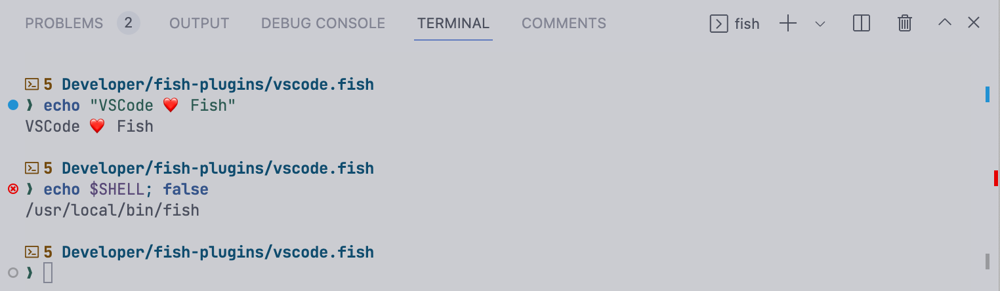

# 🆚🐟 vscode.fish

> **Note**: work in progress, but welcome to try!

[Fish](https://fishshell.com/) port of Visual Studio Code's [Terminal Shell Integration](https://code.visualstudio.com/docs/terminal/shell-integration) ([`shellIntegration-rc.zsh`](https://github.com/microsoft/vscode/blob/main/src/vs/workbench/contrib/terminal/browser/media/shellIntegration-rc.zsh)).



## Features

Differences from [experimental fish integration in latest VSCode Insiders](https://github.com/microsoft/vscode/issues/139400#issuecomment-1209929102):

- Automatic injection\*
- Ignore commands with leading spaces, [just like fish](https://fishshell.com/docs/current/interactive.html#searchable-command-history)

\* [Does not work with async prompts](https://github.com/kidonng/vscode.fish/issues/1) like [Tide](https://github.com/IlanCosman/tide) or [Hydro](https://github.com/jorgebucaran/hydro) yet

## Installation

- [plug.fish](https://github.com/kidonng/plug.fish)

  ```sh
  plug install kidonng/vscode.fish
  ```

- [Fisher](https://github.com/jorgebucaran/fisher)

  ```sh
  fisher install kidonng/vscode.fish
  ```

## Questions

**What's VSCode's native support status?**

Please refer to the [official issue tracker](https://github.com/microsoft/vscode/issues/139400).

**Do I still need to setup this if VSCode support it in the future?**

Quoting the awesome [kitty documentation](https://sw.kovidgoyal.net/kitty/shell-integration/#manual-shell-integration):

> The automatic shell integration is designed to be minimally intrusive, as such it wont work for sub-shells, terminal multiplexers, containers, etc. For such systems, you should setup manual shell integration by adding some code to your shells startup files to load the shell integration script.

## Credits

Thanks to [@zgracem](https://github.com/microsoft/vscode/issues/139400#issuecomment-1205915345) implementing a prototype and contributing to the VSCode's built-in support.
